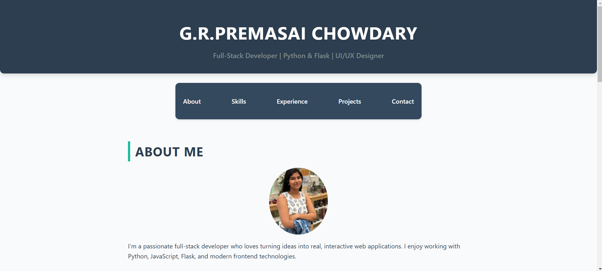
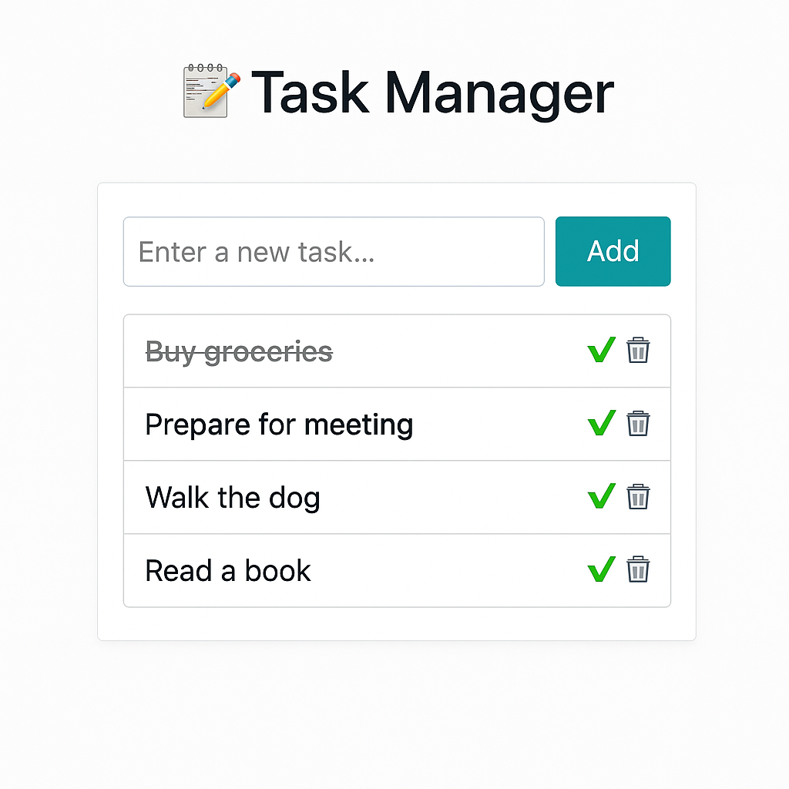

# 🌐 Portfolio Website using Flask

This is a personal **portfolio web application** built using **Python and Flask**, showcasing my skills, projects, experience, and contact information in an interactive and responsive design.

---

## 🚀 Features

- 🧑‍💻 About Me section
- 💼 Projects (with dynamic cards and images)
- 🛠️ Skills displayed in a responsive grid
- 📄 Experience timeline
- 📬 Contact information
- 🔥 React integration for dynamic components
- 🌈 Responsive and modern UI

---

## 🛠️ Technologies Used

- **Frontend**: HTML5, CSS3, JavaScript, React
- **Backend**: Python, Flask
- **Other**: Jinja2 templating, Bootstrap (optional), GitHub Pages (optional for deployment)

---

## 📷 Screenshots

### 🏠 Home Page


### 📋 Task Manager Project (Example)


> *(Make sure these image paths exist in your `static/images/` folder)*

---

## ⚙️ How to Run Locally

1. **Clone the repo**:
   ```bash
   git clone https://github.com/yourusername/your-repo-name.git
   cd your-repo-name
